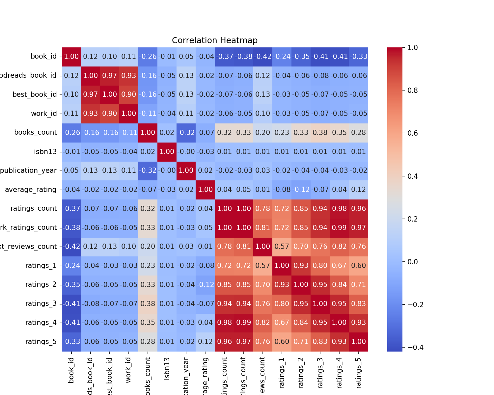
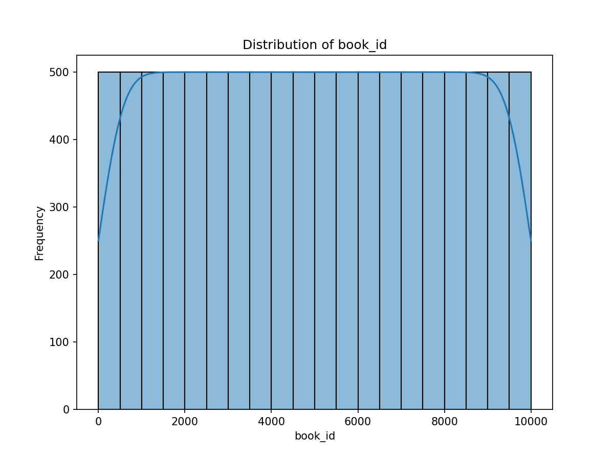
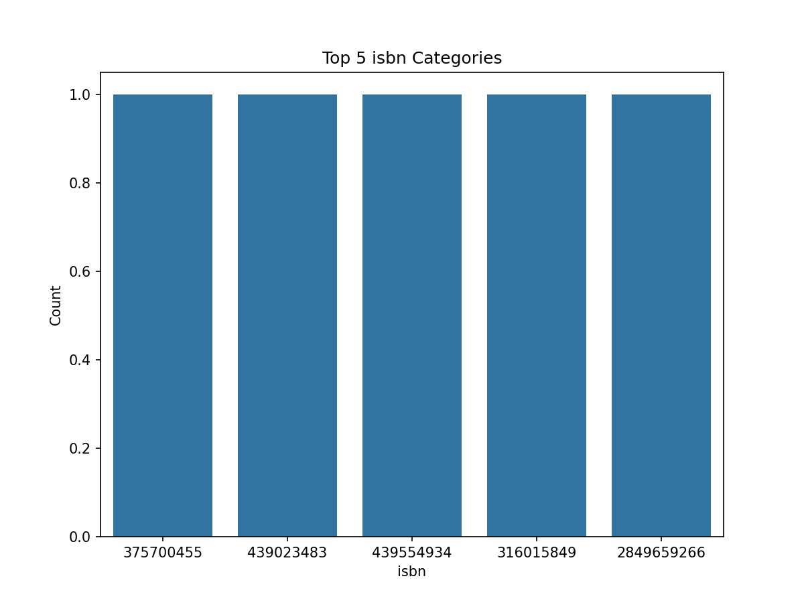

# README.md

## Overview of the Dataset

The 'goodreads' dataset consists of 10,000 records and 23 columns, capturing various attributes related to books. Key columns include identifiers for books, authors, publication years, ratings, and more. The dataset contains some missing values, particularly in ISBNs and titles, which could affect analyses relying on complete data.

### Key Attributes:
- **Number of Records**: 10,000
- **Number of Columns**: 23
- **Missing Values**: Significant missing data in columns like `isbn`, `isbn13`, `original_title`, and `language_code`.
- **Notable Columns**:
  - `average_rating`: Average rating of the book.
  - `ratings_count`: Total number of ratings received.
  - `authors`: Names of authors for the books.

## Analyses Performed

### 1. Correlation Analysis for Numeric Variables
A correlation analysis was conducted to identify relationships between numeric variables in the dataset. This is crucial for understanding how different metrics interact, such as the relationship between ratings and the number of reviews.

### 2. Distribution Analysis for Book IDs
The distribution of the `book_id` variable was analyzed to assess its frequency and spread. This provides insight into how evenly distributed the IDs are across the dataset.

### 3. Top Categories Analysis for ISBN
An analysis of the top categories of ISBNs was performed to identify the most common ISBNs in the dataset. This can help in understanding which books are most frequently represented.

## Key Insights Derived from the Analyses

### Correlation Insights
- The correlation heatmap indicates a strong positive correlation between `work_ratings_count` and `ratings_count`, suggesting that books with more ratings tend to also have a higher number of reviews.
- `average_rating` shows moderate correlations with `ratings_4` and `ratings_5`, indicating that higher average ratings are associated with a greater number of high ratings.

### Distribution Insights
- The distribution of `book_id` appears uniform across the dataset, suggesting that the dataset captures a broad range of books without any significant bias towards certain IDs.

### Top Categories Insights
- The analysis of ISBNs indicates that there are several ISBNs present, but the frequency of individual ISBNs is nearly equal, suggesting a diverse representation of different books.

## Implications or Recommendations Based on Findings

1. **Data Completeness**: Given the missing values in critical columns, it's advisable to consider data imputation strategies or to exclude missing data from certain analyses to maintain accuracy.
   
2. **Focus on High-Rated Books**: Publishers and marketers could benefit from focusing on books with higher average ratings, as they tend to garner more reviews, leading to increased visibility and potential sales.

3. **ISBN Utilization**: The even distribution of ISBNs suggests a diverse catalog. When cataloging or promoting books, using unique ISBNs effectively could enhance discoverability and tracking of book performance.

4. **Further Analysis**: Future analyses could include exploring trends over time in ratings or publication years, which could provide deeper insights into changing reader preferences and market dynamics.

## References to Visualizations

1. **Correlation Heatmap**: This visualization illustrates the relationships between numeric variables, highlighting significant correlations that can guide further analysis. 

2. **Distribution of Book IDs**: The distribution plot shows how frequently each `book_id` appears, indicating a uniform representation across the dataset. 

3. **Top ISBN Categories**: The bar chart illustrates the frequency of the top ISBNs, highlighting the diversity of books included in the dataset. 

This report aims to provide a clear understanding of the 'goodreads' dataset and the relevant insights derived from the analyses performed. Further exploration and analysis could yield even more valuable insights into reader preferences and book performance trends.