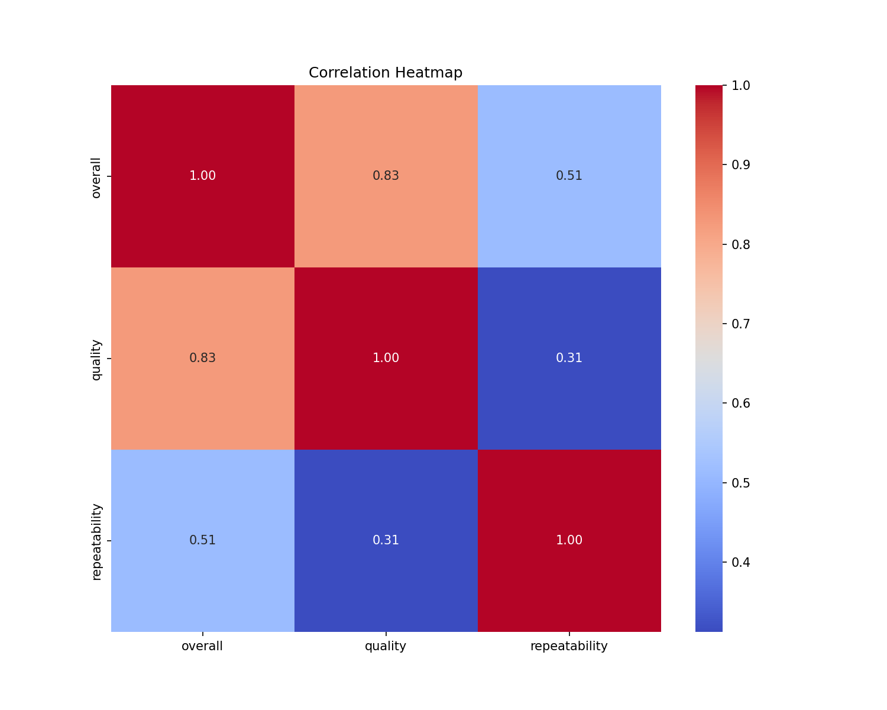
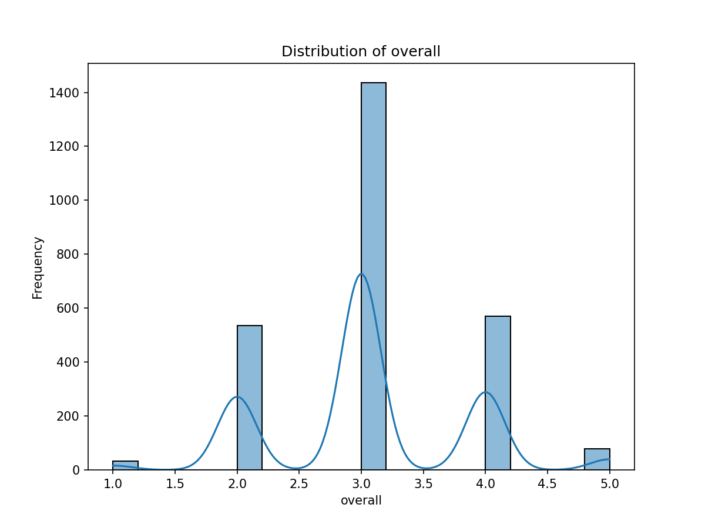
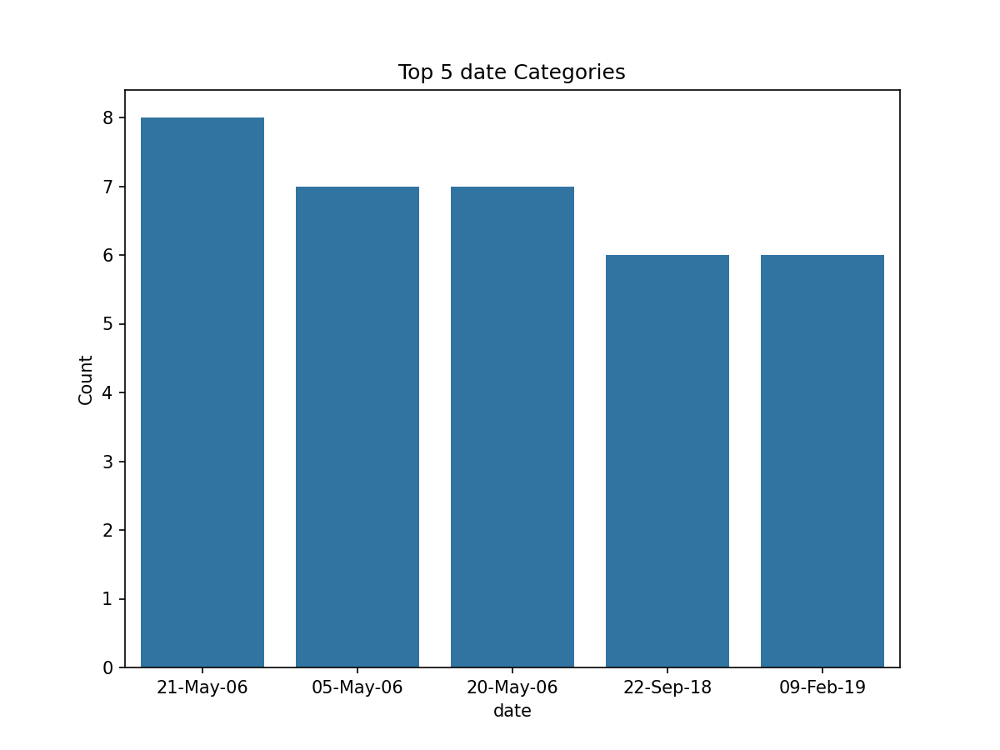

# Media Dataset Analysis Report

## 1. Dataset Overview
The dataset titled **'media'** consists of 2,652 records and 8 columns, providing insights into various media submissions. The columns include:

- **date**: Date of the media entry
- **language**: Language of the media
- **type**: Type of media (e.g., movie, series)
- **title**: Title of the media
- **by**: Creator or contributor
- **overall**: Overall rating (scale of 1 to 5)
- **quality**: Quality rating (scale of 1 to 5)
- **repeatability**: Repeatability rating (scale of 1 to 3)

### Missing Values
The dataset has missing values in the following columns:
- `date`: 99 missing entries
- `by`: 262 missing entries

### Summary Statistics
The dataset contains a variety of unique values, with notable frequency in the following:
- **Top language**: English (1,306 entries)
- **Most common type**: Movie (2,211 entries)
- **Most frequent title**: "Kanda Naal Mudhal" (9 entries)

## 2. Analyses Performed
### a. Correlation Analysis
A correlation analysis was conducted on the numeric variables: `overall`, `quality`, and `repeatability`. This analysis is crucial for understanding how these ratings relate to one another, which can inform content improvement strategies.

### b. Distribution Analysis
The distribution of the `overall` ratings was analyzed to identify trends in user satisfaction. Understanding the distribution aids in recognizing patterns in audience preferences.

### c. Top Categories Analysis
An analysis of the top entries in the `date` column provided insights into the most frequently recorded dates in the dataset. This can help identify trends over time and highlight periods of increased media engagement.

## 3. Key Insights Derived from the Analyses
### a. Correlation Insights
The correlation heatmap indicates strong positive correlations:
- `overall` and `quality`: **0.83**
- `overall` and `repeatability`: **0.51**
- `quality` and `repeatability`: **0.31**

This suggests that higher quality ratings are associated with higher overall ratings, while repeatability has a lesser correlation with both metrics.

### b. Distribution Insights
The distribution of `overall` ratings reveals that the majority of entries are clustered around a rating of **3**, indicating a neutral to positive perception. This is supported by the peak frequency in the distribution histogram.

### c. Date Analysis Insights
The top dates show multiple entries from **21-May-06**, **05-May-06**, and **20-May-06**, suggesting these dates might represent significant events or releases that garnered attention.

## 4. Implications and Recommendations
Based on the findings, several implications and recommendations can be drawn:

- **Quality Improvement**: The strong correlation between `overall` and `quality` ratings indicates that improving the quality of media content could enhance overall user satisfaction. Focus should be directed towards understanding user feedback on quality aspects.
  
- **Encourage Repeatability**: While repeatability has a lower correlation with overall satisfaction, boosting this metric could still lead to improved user engagement. Strategies such as promotional events or re-releases of popular content might be beneficial.

- **Targeted Marketing**: The insights from the date analysis should inform marketing strategies, especially around significant dates. Targeting promotions or campaigns during these key periods could increase visibility and user interaction.

## 5. References to Visualizations
- **Correlation Heatmap**: This visualization illustrates the relationships between the numeric variables, highlighting the significant correlations found in the analysis. 

- **Distribution of Overall Ratings**: This graph shows the frequency of each overall rating, indicating user satisfaction levels. 

- **Top Date Categories**: This bar chart represents the frequency of media entries recorded on certain dates, revealing trends in media submissions. 

This report summarizes the analysis of the media dataset, presenting significant insights and actionable recommendations based on the findings. Further exploration can build on these insights to enhance media quality and user experience.